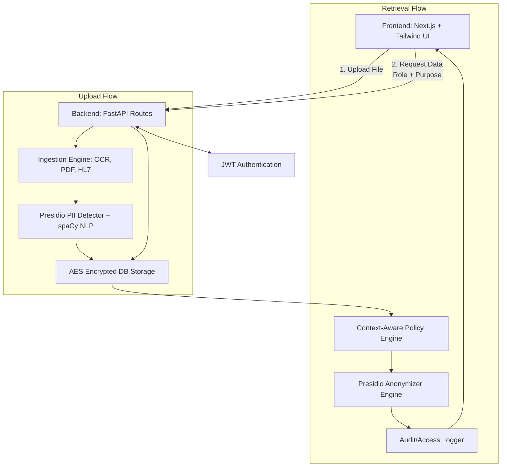
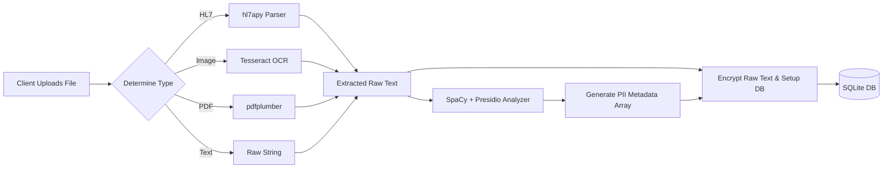
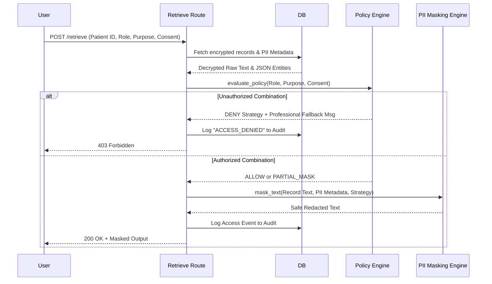

<div align="center">

# 🛡️ MedGuardX
### *Healthcare Data Protection & Context-Aware Masking System*

[](https://nextjs.org/)
[](https://fastapi.tiangolo.com/)
[](https://www.typescriptlang.org/)
[](https://www.python.org/)
[](https://tailwindcss.com/)

🚀 **Live Deployment**: [med-guard-x.vercel.app](https://med-guard-x.vercel.app/)

</div>

---

## 📖 Overview

MedGuardX is a state-of-the-art, independent healthcare data protection suite designed to fundamentally transform how sensitive medical data is ingested, stored, and shared. 

Unlike basic redaction tools, MedGuardX functions as an **Intelligent Security Gateway** and **Data Vault**. It handles structured HL7 data, unstructured clinical notes, PDFs, and medical images (through advanced OCR) by detecting PII/PHI (Personally Identifiable Information / Protected Health Information) and dynamically applying context-specific security policies *before* data is ever exposed to a user.

---

## 📸 Snapshot Overview


*Professional healthcare analytics dashboard with real-time security telemetry.*

---

## 🔥 Novelty & Key Differentiators

What makes MedGuardX stand out against standard healthcare systems?

1. **Dynamic Context-Aware Masking**: Data is not just "masked" permanently in the database. Instead, raw data is heavily encrypted at rest. When retrieved, it passes through an intelligent Policy Engine where the `(Role × Purpose × Patient Consent)` matrix determines exactly *how* the data should look.
2. **Multi-Format Ingestion Engine**: Automatically identifies and pulls text from standard raw strings, complex PDF files, scanned images (via Tesseract OCR), and HL7 health data messages.
3. **Indian PII Support**: In addition to standard emails/phones, the AI natively detects distinct Indian identifiers such as Aadhaar and PAN cards.
4. **Zero Data Leakage Philosophy**: Ensures precise NLP boundaries. When performing partial masking, phone numbers and emails are replaced safely with structured token templates instead of leaving variable chunks unmasked.
5. **Indelible Audit Trails**: Chronological tracking of every access attempt (Allowed/Denied) for guaranteed compliance and accountability.

---

## 🛠️ Technology Stack & Modules Used

<details>
<summary><b>Frontend Layer (Next.js 14)</b></summary>
<ul>
  <li><b>Framework</b>: Next.js 14 (App Router), React 18</li>
  <li><b>UI/UX</b>: Tailwind CSS, Framer Motion (for fluid micro-interactions, spring transitions, and glassmorphism)</li>
  <li><b>Icons</b>: Lucide React</li>
  <li><b>Language</b>: TypeScript for strict type-safety across components.</li>
</ul>
</details>

<details>
<summary><b>Backend Core (Python 3.10+)</b></summary>
<ul>
  <li><b>API Framework</b>: FastAPI & Uvicorn (Asynchronous, lightning fast)</li>
  <li><b>Security & Encryption</b>: <code>cryptography</code> (Fernet symmetric AES-256 encryption) and <code>passlib</code> / <code>python-jose</code> for JWT Auth & password hashing.</li>
  <li><b>NLP & PII Detection</b>: <code>presidio-analyzer</code> & <code>presidio-anonymizer</code> (Microsoft Presidio) backed by <code>spaCy</code> (<code>en_core_web_lg</code> transformer-ready NLP model)</li>
  <li><b>Database</b>: SQLite (built-in relational storage)</li>
</ul>
</details>

<details>
<summary><b>Data Processing Ingestion Modules</b></summary>
<ul>
  <li><b>OCR</b>: <code>pytesseract</code> & <code>Pillow</code> & <code>Tesseract-OCR</code> for optical character recognition from medical scan images.</li>
  <li><b>PDF Extraction</b>: <code>pdfplumber</code> for extracting structural text blocks from medical PDF reports.</li>
  <li><b>Medical Syntax</b>: <code>hl7apy</code> for parsing medical Health Level Seven (HL7) messages.</li>
</ul>
</details>

---

## ⚡ Core Features & Showcase

### 1. Multi-Format Secure Uploads
**Visual Upload Pipeline**: Drag & drop UI with immediate PII tracking. Automatically detects the file type and routes it through the appropriate ingestion engine.


### 2. Context-Aware Data Retrieval
**RBAC & Purpose-Based Retrieval**: Define retrieval intent (Treatment, Research, Billing, Legal) mapped directly to your user role (Doctor, Nurse, Researcher, Company). Security rules dynamically tighten or ease depending on explicit Patient Consent toggles.


### 3. Transparent Compliance Auditing
**Indelible Audit Trails**: Every single data access attempt—whether permitted, partially masked, or outright denied—is permanently tracked and displayed in an interactive Audit table.


---

## 📂 Project Structure

```text
.
├── backend
│   ├── app
│   │   ├── auth.py          # JWT & Authentication logic
│   │   ├── database.py      # SQLAlchemy/SQLite session mgmt
│   │   ├── main.py          # FastAPI application entry
│   │   ├── models.py        # Database schema definitions
│   │   ├── routes/          # API endpoint controllers
│   │   └── services/        # PII Detection & Encryption logic
│   ├── medguardx.db         # Local encrypted store
│   └── requirements.txt     # Python dependencies
├── docs
│   └── screenshots/         # UI visual assets
├── frontend
│   ├── public/              # Static assets
│   ├── src
│   │   ├── app/             # Next.js App Router pages
│   │   ├── components/      # Reusable UI components
│   │   └── lib/             # API clients & utilities
│   ├── tailwind.config.ts   # UI Theme configurations
│   └── tsconfig.json        # TypeScript configuration
└── README.md                # Project documentation
```

---

## 🏗️ System Architecture

### High-Level Flow


### Low-Level Design & Workflow


### Retrieval Sequence Logic


---

## 🔌 API Endpoints Detailed

| Endpoint | Method | Purpose |
|----------|--------|---------|
| `/api/register` | `POST` | Registers a new user with a hashed password. Requires username, password, Role, full name. |
| `/api/login` | `POST` | Authenticates user credentials and returns a Bearer JWT Token. |
| `/api/upload` | `POST` | Mutli-part form upload endpoint for `.txt`, `.pdf`, `.png`, and `.hl7`. Analyzes and saves encrypted raw data. |
| `/api/retrieve` | `POST` | Retrieves records for a specific `patient_id`. Expects JSON body with `role`, `purpose`, and `consent`. Evaluates policy dynamically and returns the masked text string. |
| `/api/preview` | `POST` | Live testing sandbox endpoint. Provide raw text, role, purpose, and consent. Returns what the masking engine would output. |
| `/api/audit` | `GET` | Paginated endpoint (`?limit=&offset=`) to fetch all tracking and access logs in descending order. |
| `/api/stats` | `GET` | Dashboard telemetry endpoint (counts of patients, records, security accesses last 7 days). |

---

## 🚀 Installation & Setup

### Prerequisites
- Node.js 18+
- Python 3.10+
- `tesseract` binary installed on system (macOS: `brew install tesseract`)

### 1. Backend Setup
```bash
cd backend
python3 -m venv venv
source venv/bin/activate
pip install -r requirements.txt
python -m spacy download en_core_web_lg
uvicorn app.main:app --reload --port 8000
```

### 2. Frontend Setup
```bash
cd frontend
npm install
npm run dev
```

The application will be available at `http://localhost:3000`.

---

## 🩺 How to Use It (Examples & Feature Matching)

**1. Creating an Account & Dashboard**
- Go to `/login` (via UI Auth tab). Register an account (e.g., select **Doctor**) and log in.
- The UI will route you to the Dashboard (`/`) where you can see live animated telemetry numbers driven by the backend `/api/stats`.

**2. Uploading Data**
- Go to the **Upload Data** tab.
- Drag and drop a fake clinical note text file, a chest X-Ray (with text on it), or a `.pdf` medical bill. 
- *Under the hood*: The file is routed to ingestion processors. Tesseract handles the images. The text is passed into Microsoft Presidio.
- The UI will immediately notify you how many PII entities (Names, Phones, URLs, Locations) were recognized and successfully stored. **Copy the returned Patient ID!**

**3. Retrieving Data (Policy Evaluation)**
- Go to the **Retrieve** tab.
- Paste your Patient ID.
- Since you are a **Doctor**, try retrieving records under purpose **Legal** without consent. 
- *Result*: The system will throw a beautiful UI error specifically stating: *"Access denied: Doctors have no authorization for legal data retrieval."* This perfectly matches the explicit rules governed in the Policy Engine.
- Switch the purpose to **Treatment** and select the Consent toggle to **ON**. Hit Retrieve.
- *Result*: You will get your full unmasked result. 

**4. Testing Partial Masking**
- Switch your role on the Retrieve screen to **Nurse**, purpose **Treatment**, and turn Consent **OFF**.
- *Result*: The system triggers `PARTIAL_MASK` routing. In the textbox output, all phone numbers will turn strictly into `[PHONE_MASKED]` and names into `[NAME_MASKED]`, safely obfuscated.

**5. Monitoring the Audit Trail**
- Navigate to the **Audit Logs** tab. 
- You will see chronological logs of every file uploaded, every denied "Legal" attempt, and every successfully masked dataset retrieval attempt, forming an immutable chain of accountability.

---

## 🛡️ Compliance & Standards
MedGuardX is built with a **Privacy-by-Design** philosophy, adhering to global and local healthcare regulations:
- ✅ **DPDP Act (India)**: Native PII/PHI detection for Aadhaar/PAN cards.
- ✅ **GDPR**: Implements data minimization and purpose-based access.
- ✅ **IT Act 2000**: Robust encryption for data at rest (AES-256).

---

## 📄 License
MedGuardX is licensed under the MIT License. See `LICENSE` for more details.

---
*Built with ❤️ for secure healthcare by Adarsh.*
