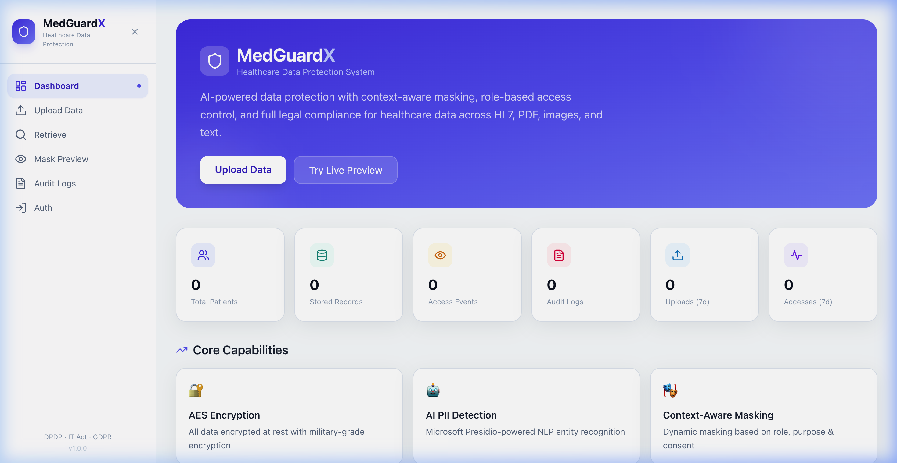
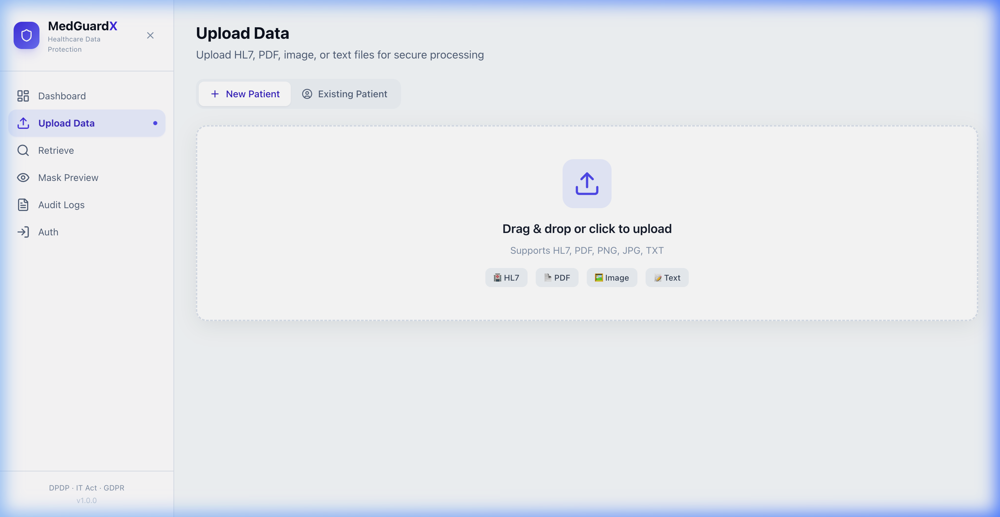
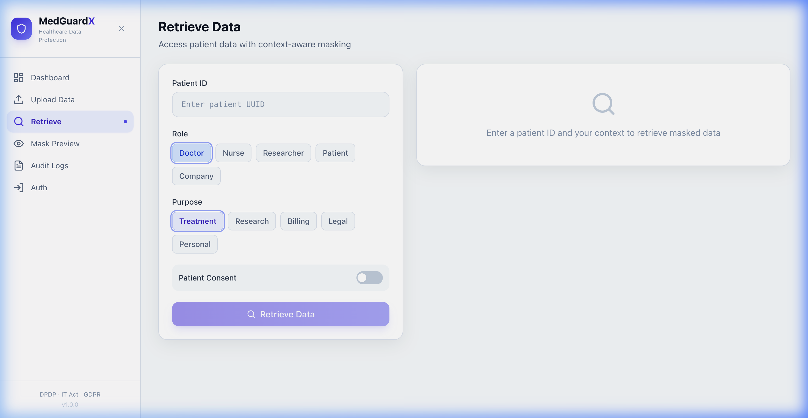
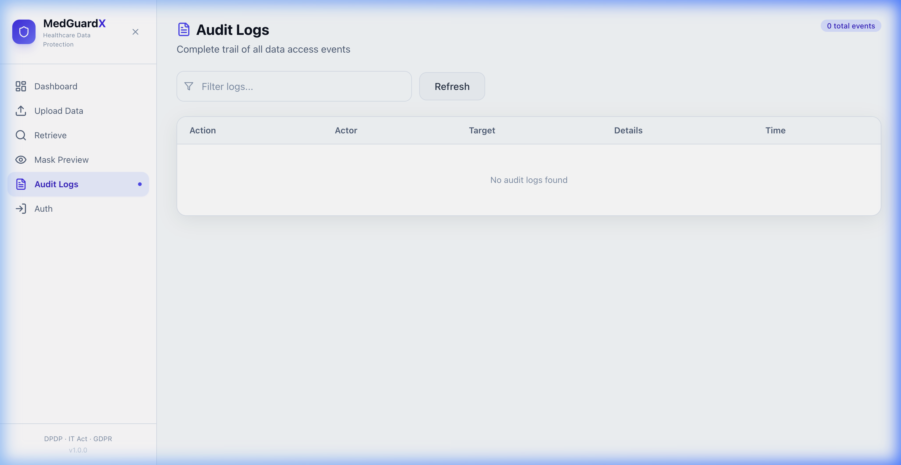
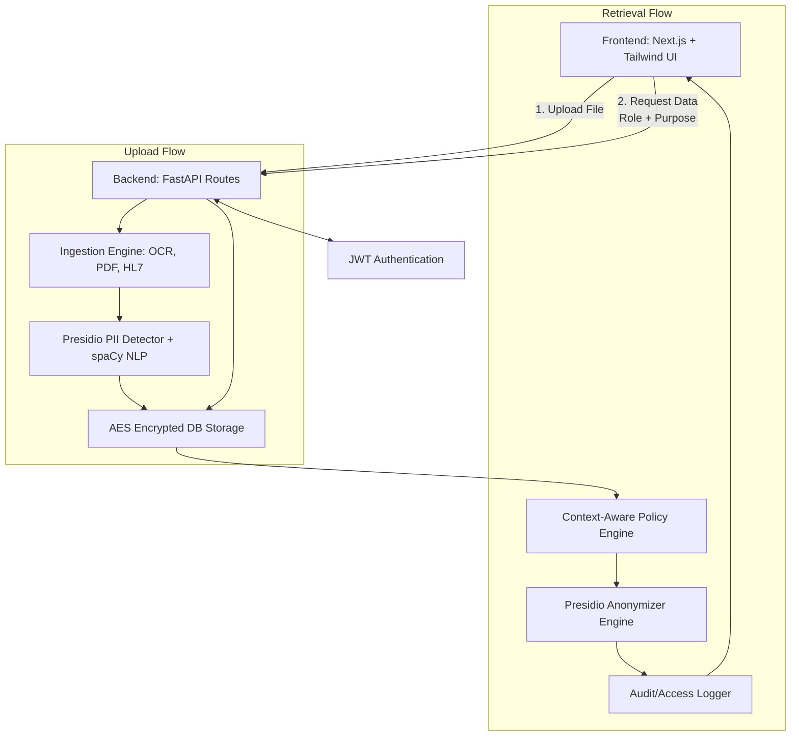
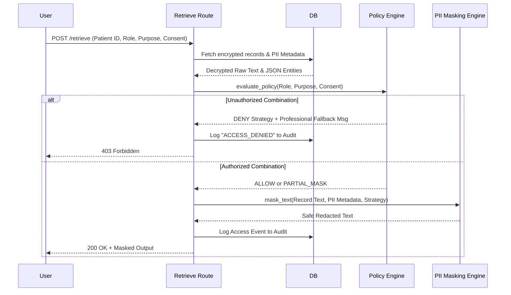

<div align="center">

# 🛡️ MedGuardX
### *Healthcare Data Protection & Context-Aware Masking System*

[](https://nextjs.org/)
[](https://fastapi.tiangolo.com/)
[](https://www.typescriptlang.org/)
[](https://www.python.org/)
[](https://tailwindcss.com/)

🚀 **Live Deployment**: [med-guard-x.vercel.app](https://med-guard-x.vercel.app/)

</div>

---

## 📖 Overview

MedGuardX is a complete healthcare data protection system designed to fundamentally change how sensitive medical data is ingested, stored, and shared. It functions as an **intelligent data vault** and **context-aware masking engine**, detecting PII/PHI (Personally Identifiable Information / Protected Health Information) and dynamically applying security policies.

### ✨ Key Differentiators
- **Dynamic Context-Aware Masking**: Evaluates the `(Role × Purpose × Patient Consent)` matrix in real-time.
- **Multi-Format Ingestion**: Supports raw text, HL7 messages, PDFs, and scanned images (Tesseract OCR).
- **AI-PII Detection**: Powered by Microsoft Presidio & spaCy with native support for Indian identifiers (Aadhaar/PAN).
- **Indelible Audit Trails**: Chronological tracking of every access attempt for complete accountability.

---

## 📸 Core Capabilities & Showcase

### 1. Intelligent Dashboard
Real-time security telemetry and high-level statistics for your healthcare data ecosystem.


### 2. Multi-Format Secure Upload
Supports HL7, PDF, PNG, JPG, and TXT. Tesseract OCR processes images to extract and protect clinical data.


### 3. Contextual Data Retrieval
Paste a Patient UUID and define your context. Masking is applied instantly based on user roles and patient consent.


### 4. Immutable Access Audit
A transparent chain of accountability tracking every denied and permitted access event.


---

## 📂 Project Structure

```text
.
├── backend
│   ├── app
│   │   ├── auth.py          # JWT & Authentication logic
│   │   ├── database.py      # SQLAlchemy/SQLite session mgmt
│   │   ├── main.py          # FastAPI application entry
│   │   ├── models.py        # Database schema definitions
│   │   ├── routes/          # API endpoint controllers
│   │   └── services/        # PII Detection & Encryption logic
│   ├── medguardx.db         # Local encrypted store
│   └── requirements.txt     # Python dependencies
├── docs
│   └── screenshots/         # UI visual assets
├── frontend
│   ├── public/              # Static assets
│   ├── src
│   │   ├── app/             # Next.js App Router pages
│   │   ├── components/      # Reusable UI components
│   │   └── lib/             # API clients & utilities
│   ├── tailwind.config.ts   # UI Theme configurations
│   └── tsconfig.json        # TypeScript configuration
└── README.md                # Project documentation
```

---

## 🏗️ System Architecture

### High-Level Flow


### Retrieval Sequence Logic


---

## 🚀 Installation & Setup

### Prerequisites
- Node.js 18+
- Python 3.10+
- `tesseract` binary (`brew install tesseract` on macOS)

### 1. Backend Setup
```bash
cd backend
python3 -m venv venv
source venv/bin/activate
pip install -r requirements.txt
python -m spacy download en_core_web_lg
uvicorn app.main:app --reload --port 8000
```

### 2. Frontend Setup
```bash
cd frontend
npm install
npm run dev
```

---

## 🛡️ Compliance & Standards
MedGuardX is built with a **Privacy-by-Design** philosophy, adhering to global and local healthcare regulations:
- ✅ **DPDP Act (India)**: Native PII/PHI detection for Aadhaar/PAN cards.
- ✅ **GDPR**: Implements data minimization and purpose-based access.
- ✅ **IT Act 2000**: Robust encryption for data at rest (AES-256).

---

## 📄 License
MedGuardX is licensed under the MIT License. See `LICENSE` for more details.

---
*Built with ❤️ for secure healthcare by Adarsh.*
