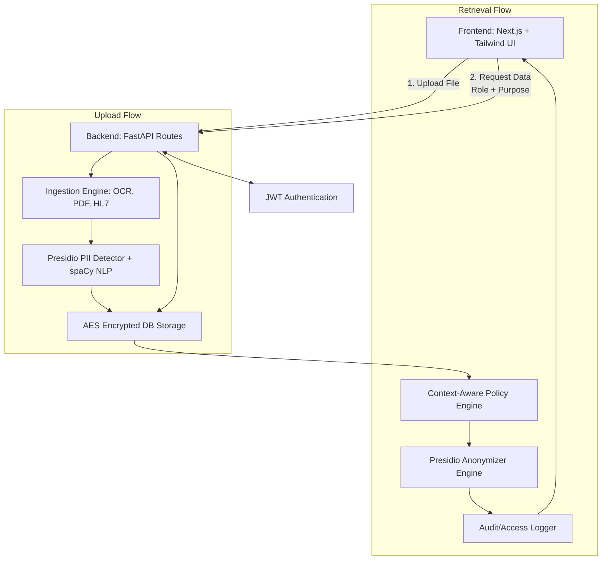
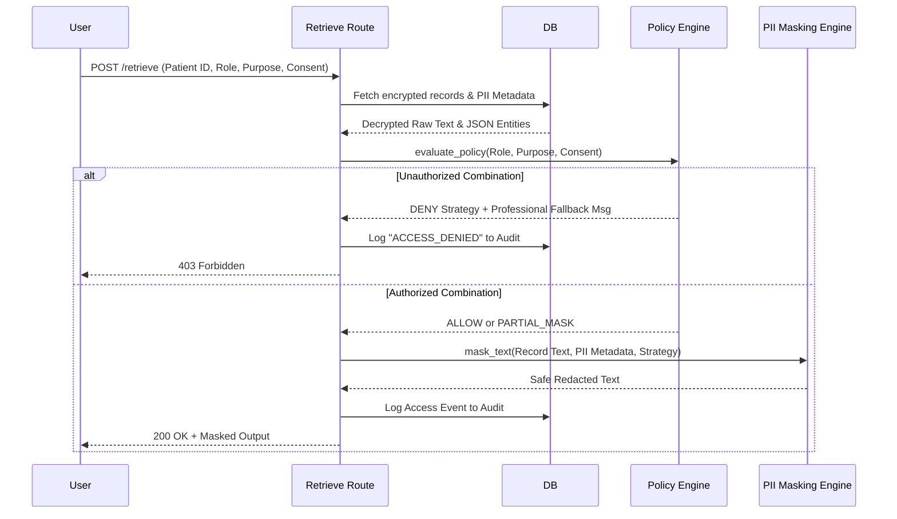

# 🛡️ MedGuardX: Healthcare Data Protection System
### *Zero-Knowledge Data Vault & Context-Aware Masking Engine*

MedGuardX is a state-of-the-art healthcare data protection suite designed to fundamentally transform how sensitive medical data is ingested, stored, and shared. Unlike standard redaction tools, MedGuardX functions as an **Intelligent Security Gateway**, handling structured HL7 data, unstructured clinical notes, and medical images through advanced AI-PII detection and context-specific security policies.

🚀 **Live Deployment**: [med-guard-x.vercel.app](https://med-guard-x.vercel.app/)

---

## 📸 Snapshot Overview


*Professional healthcare analytics dashboard with real-time security telemetry.*

---

## 🔥 Key Differentiators

| Feature | Description | Benefit |
| :--- | :--- | :--- |
| **Dynamic Context Masking** | Evaluates `(Role × Purpose × Patient Consent)` matrix in real-time. | Ensures zero data leakage for unauthorized roles. |
| **Multi-Format Ingestion** | Supports raw text, HL7 messages, PDFs, and scanned images (OCR). | Universal medical data compatibility. |
| **AI-PII Recognition** | Powered by Microsoft Presidio & spaCy Transformers. | Native support for global and Indian identifiers (Aadhaar/PAN). |
| **Immutable Audit Log** | Chronological tracking of every access attempt (Allowed/Denied). | Guaranteed compliance and accountability. |

---

## 🛠️ Technology Stack

<details>
<summary><b>Frontend Layer (Next.js 14)</b></summary>
<ul>
  <li><b>Framework</b>: Next.js 14 (App Router)</li>
  <li><b>UI/UX</b>: Tailwind CSS, Framer Motion (Glassmorphism & Micro-interactions)</li>
  <li><b>Icons</b>: Lucide React</li>
  <li><b>Language</b>: TypeScript</li>
</ul>
</details>

<details>
<summary><b>Backend Core (FastAPI)</b></summary>
<ul>
  <li><b>API</b>: FastAPI & Uvicorn (Asynchronous Python)</li>
  <li><b>Security</b>: Fernet (AES-256) Encryption & JWT Auth</li>
  <li><b>NLP Engine</b>: Microsoft Presidio & `en_core_web_lg` spaCy models</li>
  <li><b>Database</b>: SQLite (Relational Storage)</li>
</ul>
</details>

<details>
<summary><b>Data Processing Modules</b></summary>
<ul>
  <li><b>OCR</b>: Tesseract-OCR & Pillow</li>
  <li><b>PDF Extraction</b>: pdfplumber</li>
  <li><b>Medical Syntax</b>: hl7apy</li>
</ul>
</details>

---

## 🏗️ System Architecture

### High-Level Flow


### Retrieval Sequence Logic


---

## ⚡ Core Modules & Showcase

### 1. Multi-Format Secure Uploads
Drag & drop medical records. MedGuardX automatically detects the file type and routes it through the appropriate ingestion engine.


### 2. Context-Aware Data Retrieval
Paste a Patient UUID and define your context. Based on your role and the patient's consent, the data is dynamically masked.


### 3. Transparent Compliance Auditing
Every interaction is logged. This ensures complete transparency for regulatory bodies like GDPR, HIPAA, and DPDP.


---

## 🚀 Getting Started

### Prerequisites
- Node.js 18+
- Python 3.10+
- `tesseract` binary (`brew install tesseract` on macOS)

### 1. Backend Setup
```bash
cd backend
python3 -m venv venv
source venv/bin/activate
pip install -r requirements.txt
python -m spacy download en_core_web_lg
uvicorn app.main:app --reload --port 8000
```

### 2. Frontend Setup
```bash
cd frontend
npm install
npm run dev
```
The app will be live at `http://localhost:3000`.

---

## 🛡️ Compliance Standards
MedGuardX is built with a **Privacy-by-Design** philosophy, adhering to:
- ✅ **DPDP Act (India)**: Native PII/PHI detection for Aadhaar/PAN.
- ✅ **GDPR**: Right to be forgotten and data minimization.
- ✅ **IT Act 2000**: Robust encryption standards (AES-256).

---

## 📄 License
MedGuardX is licensed under the MIT License. See `LICENSE` for more details.

---
*Built for the future of secure healthcare by Adarsh.*
