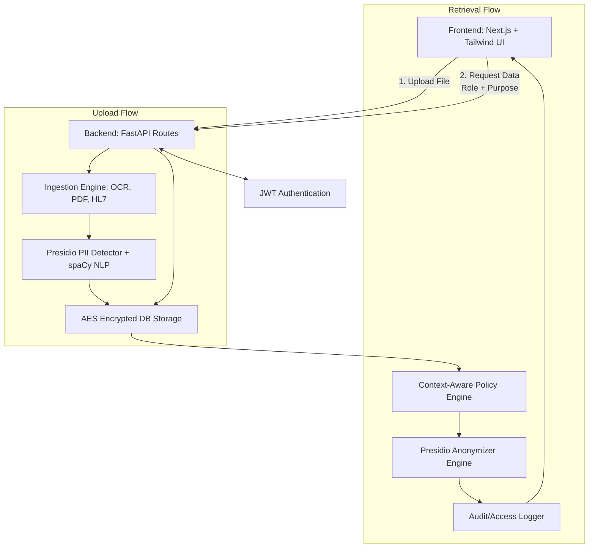
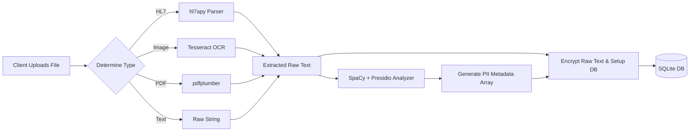
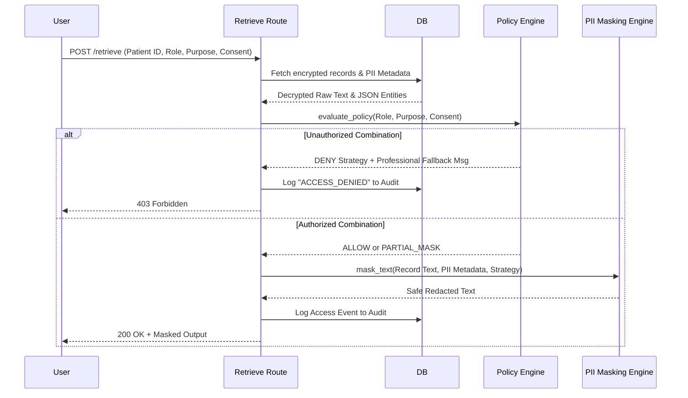

# MedGuardX - Healthcare Data Protection System

MedGuardX is a complete, independent healthcare data protection system designed to fundamentally change how sensitive medical data is ingested, stored, and shared. 

Unlike basic redaction tools, MedGuardX functions as an intelligent data vault and context-aware masking engine. It handles structured HL7 data, unstructured clinical notes, PDFs, and medical images (through advanced OCR), detecting PII/PHI (Personally Identifiable Information / Protected Health Information) and dynamically applying context-specific security policies before data is ever exposed to a user.

---

##  Novelty & Key Differentiators

What makes MedGuardX stand out against standard healthcare systems?
1. **Dynamic Context-Aware Masking**: Data is not just "masked" permanently in the database. Instead, raw data is heavily encrypted at rest. When retrieved, it passes through an intelligent Policy Engine where the `(Role × Purpose × Patient Consent)` matrix determines exactly *how* the data should look.
2. **Multi-Format Ingestion Engine**: Automatically identifies and pulls text from standard raw strings, complex PDF files, scanned images (via Tesseract OCR), and HL7 health data messages.
3. **Indian PII Support**: In addition to standard emails/phones, the AI natively detects distinct Indian identifiers such as Aadhaar and PAN cards.
4. **Zero Data Leakage Philosophy**: Ensures precise NLP boundaries. When performing partial masking, phone numbers and emails are replaced safely with structured token templates instead of leaving variable chunks unmasked.

---

##  Tech Stack & Modules Used

### **Frontend layer**
- **Framework**: Next.js 14, React 18
- **Styling**: Tailwind CSS, Framer Motion (for fluid micro-interactions, spring transitions, and glassmorphism)
- **Icons**: Lucide React
- **Language**: TypeScript for strict type-safety across components.

### **Backend Core (Python 3.10+)**
- **API Framework**: FastAPI & Uvicorn (Asynchronous, lightning fast)
- **Database**: SQLite (built-in relational database)
- **NLP & PII Detection**: `presidio-analyzer` & `presidio-anonymizer` (Microsoft Presidio) backed by `spaCy` (`en_core_web_lg` transformer-ready NLP model)
- **Security & Encryption**: `cryptography` (Fernet symmetric AES encryption) and `passlib` / `python-jose` for JWT Auth & password hashing.
- **Data Ingestion Modules**:
  - `hl7apy`: For parsing medical Health Level Seven (HL7) messages.
  - `pdfplumber`: Extracting structural text blocks from medical PDF reports.
  - `pytesseract` & `Pillow` & `Tesseract-OCR`: For optical character recognition from medical scan images.

---

##  Features

- **RBAC & Purpose-Based Retrieval**: Define retrieval intent (Treatment, Research, Billing, Legal) mapped directly to your user role (Doctor, Nurse, Researcher, Company). 
- **Patient Consent Toggles**: Security rules dynamically tighten or ease depending on explicit Patient Consent checks during data retrieval.
- **Visual Upload Pipeline**: Drag & drop UI with immediate PII tracking. 
- **Real-Time Masking Preview**: Interactive sandbox dashboard to see how the Anonymizer engine affects dummy text instantly.
- **Indelible Audit Trails**: Every single data access attempt—whether permitted, partially masked, or outright denied—is permanently tracked and displayed in an interactive Audit table.

---

##  High-Level Full Architecture



---

##  Low-Level Design & Workflow



### Retrieval Sequence Diagram



---

##  API Endpoints Detailed

| Endpoint | Method | Purpose |
|----------|--------|---------|
| `/api/register` | `POST` | Registers a new user with a hashed password. Requires username, password, Role, full name. |
| `/api/login` | `POST` | Authenticates user credentials and returns a Bearer JWT Token. |
| `/api/upload` | `POST` | Mutli-part form upload endpoint for `.txt`, `.pdf`, `.png`, and `.hl7`. Analyzes and saves encrypted raw data. |
| `/api/retrieve` | `POST` | Retrieves records for a specific `patient_id`. Expects JSON body with `role`, `purpose`, and `consent`. Evaluates policy dynamically and returns the masked text string. |
| `/api/preview` | `POST` | Live testing sandbox endpoint. Provide raw text, role, purpose, and consent. Returns what the masking engine would output. |
| `/api/audit` | `GET` | Paginated endpoint (`?limit=&offset=`) to fetch all tracking and access logs in descending order. |
| `/api/stats` | `GET` | Dashboard telemetry endpoint (counts of patients, records, security accesses last 7 days). |

---

##  How to Run It

### Prerequisites
- Node.js 18+
- Python 3.10+
- `tesseract` binary installed on system (macOS: `brew install tesseract`)

### 1. Start the Backend
```bash
cd backend
python3 -m venv venv
source venv/bin/activate
pip install -r requirements.txt
python -m spacy download en_core_web_lg
uvicorn app.main:app --reload --port 8000
```

### 2. Start the Frontend
```bash
cd frontend
npm install
npm run dev
```

The application will be available at `http://localhost:3000`.

---

##  How to Use It (Examples & Feature Matching)

**1. Creating an Account & Dashboard**
- Go to `/login` (via UI Auth tab). Register an account (e.g., select **Doctor**) and log in.
- The UI will route you to the Dashboard (`/`) where you can see live animated telemetry numbers driven by the backend `/api/stats`.

**2. Uploading Data**
- Go to the **Upload Data** tab.
- Drag and drop a fake clinical note text file, a chest X-Ray (with text on it), or a `.pdf` medical bill. 
- *Under the hood*: The file is routed to ingestion processors. Tesseract handles the images. The text is passed into Microsoft Presidio.
- The UI will immediately notify you how many PII entities (Names, Phones, URLs, Locations) were recognized and successfully stored. **Copy the returned Patient ID!**

**3. Retrieving Data (Policy Evaluation)**
- Go to the **Retrieve** tab.
- Paste your Patient ID.
- Since you are a **Doctor**, try retrieving records under purpose **Legal** without consent. 
- *Result*: The system will throw a beautiful UI error specifically stating: *"Access denied: Doctors have no authorization for legal data retrieval."* This perfectly matches the explicit rules governed in the Policy Engine.
- Switch the purpose to **Treatment** and select the Consent toggle to **ON**. Hit Retrieve.
- *Result*: You will get your full unmasked result. 

**4. Testing Partial Masking**
- Switch your role on the Retrieve screen to **Nurse**, purpose **Treatment**, and turn Consent **OFF**.
- *Result*: The system triggers `PARTIAL_MASK` routing. In the textbox output, all phone numbers will turn strictly into `[PHONE_MASKED]` and names into `[NAME_MASKED]`, safely obfuscated.

**5. Monitoring the Audit Trail**
- Navigate to the **Audit Logs** tab. 
- You will see chronological logs of every file uploaded, every denied "Legal" attempt, and every successfully masked dataset retrieval attempt, forming an immutable chain of accountability.
