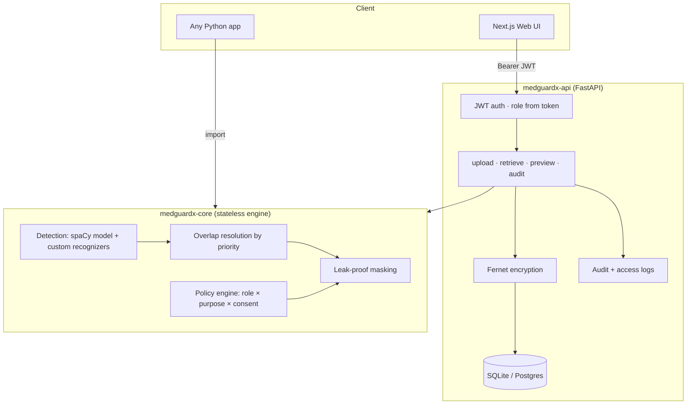
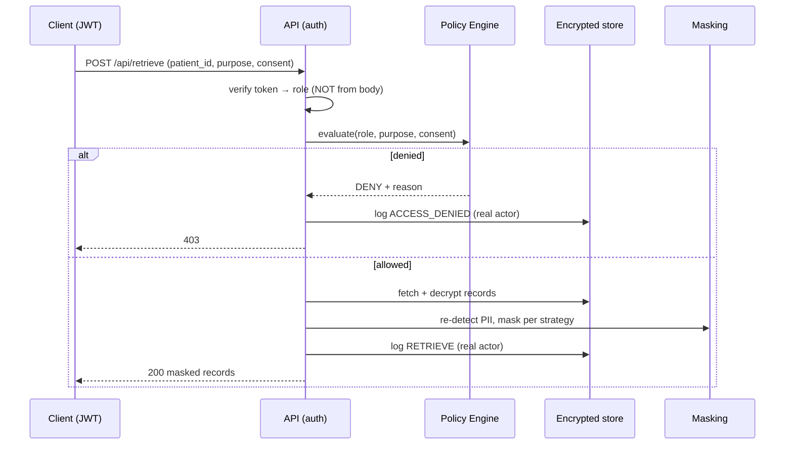

<div align="center">

# 🛡️ MedGuardX

### Context-Aware PII/PHI Detection & Masking for Healthcare Data

A reusable masking **engine** you embed anywhere, plus a hardened **reference deployment**.

[](.github/workflows/ci.yml)
[](packages/medguardx-core)
[](apps/api)
[](apps/web)
[](https://microsoft.github.io/presidio/)

🚀 **Live demo:** [med-guard-x.vercel.app](https://med-guard-x.vercel.app/)

`pii` · `phi` · `masking` · `anonymization` · `presidio` · `hipaa` · `dpdp` · `gdpr` · `healthcare`

</div>

---

## 📖 Overview

MedGuardX detects sensitive identifiers (PII/PHI) in healthcare text — clinical
notes, PDFs, scanned images, HL7 messages — and applies **context-aware masking**:
what a requester sees is decided at read time by a `(role × purpose × consent)`
policy, not baked into storage. Raw text is encrypted at rest; masking happens on
retrieval.

It ships in two layers so it is genuinely reusable:

| Layer | What it is | Who uses it |
|-------|-----------|-------------|
| [`medguardx-core`](packages/medguardx-core) | A **stateless** pip-installable engine: detect → policy → mask. No auth, no DB. | Any Python project embedding masking |
| [`medguardx-api`](apps/api) | A hardened FastAPI **service** wrapping the core: enforced JWT auth, pluggable storage, encryption, audit. | Anyone self-hosting the full app / HTTP integrators |
| [`web`](apps/web) | The Next.js reference UI. | The live demo |

### Why this design

The engine is stateless and auth-agnostic on purpose: an embeddable library that
never authenticates has no auth to bypass, and an engine that never stores has no
database to leak. Everything stateful — identity, persistence, audit — lives in the
service layer, where it is enforced and tested.

---

## 🔥 Key Features

| Feature | Detail |
|---|---|
| **Bring-your-own model** | Any spaCy English pipeline: `sm` / `md` / `lg` / `trf`. Pick your accuracy/RAM trade-off; the deployment uses `md`. |
| **Model-independent structured IDs** | Aadhaar (Verhoeff-validated), PAN, MRN, credit cards, IBAN, IP matched by format — they work identically on every model. |
| **Deterministic, leak-proof masking** | Overlapping detections resolved by fixed priority; no strategy ever leaves part of a detected identifier visible. |
| **Enforced RBAC** | JWT verified on every protected route; the requester's role comes from the **token**, never the request body. |
| **Encrypted at rest** | Fernet (AES-128-CBC + HMAC). Production refuses to start without a real key. |
| **Pluggable storage** | One code path over SQLAlchemy: SQLite for dev, Postgres for production. |
| **Attributable audit trail** | Every access logged with the real authenticated actor and applied policy. |

---

## 🏗️ Architecture


```mermaid
flowchart TD
    subgraph Client
      WEB[Next.js Web UI]
      SDK[Any Python app]
    end

    subgraph Service["medguardx-api (FastAPI)"]
      AUTH[JWT auth · role from token]
      ROUTES[upload · retrieve · preview · audit]
      ENC[Fernet encryption]
      STORE[(SQLite / Postgres)]
      AUDIT[Audit + access logs]
    end

    subgraph Core["medguardx-core (stateless engine)"]
      DET[Detection: spaCy model + custom recognizers]
      OVL[Overlap resolution by priority]
      POL[Policy engine: role × purpose × consent]
      MASK[Leak-proof masking]
    end

    WEB -->|Bearer JWT| AUTH
    AUTH --> ROUTES
    ROUTES --> ENC --> STORE
    ROUTES --> AUDIT
    ROUTES --> Core
    SDK -->|import| Core
    DET --> OVL --> MASK
    POL --> MASK
```

### Retrieval flow


```mermaid
sequenceDiagram
    participant U as Client (JWT)
    participant A as API (auth)
    participant P as Policy Engine
    participant DB as Encrypted store
    participant M as Masking

    U->>A: POST /api/retrieve (patient_id, purpose, consent)
    A->>A: verify token → role (NOT from body)
    A->>P: evaluate(role, purpose, consent)
    alt denied
      P-->>A: DENY + reason
      A->>DB: log ACCESS_DENIED (real actor)
      A-->>U: 403
    else allowed
      A->>DB: fetch + decrypt records
      A->>M: re-detect PII, mask per strategy
      A->>DB: log RETRIEVE (real actor)
      A-->>U: 200 masked records
    end
```

---

## 🧠 The Masking Pipeline (with real numbers)

1. **Ingest** — text/PDF (`pdfplumber`), image (`pytesseract` OCR), or HL7 (`hl7apy`).
2. **Detect** — Presidio + the configured spaCy model, plus model-independent regex
   recognizers for Aadhaar/PAN/MRN.
3. **Resolve overlaps** — when spans collide, a fixed priority table picks the winner
   (`IN_AADHAAR`/`CREDIT_CARD` > `PHONE_NUMBER` > `PERSON` > …). This removes the
   nondeterminism where a generic `DATE_TIME` span used to shadow a phone number.
4. **Evaluate policy** — `(role, purpose, consent) → strategy` (deny-by-default).
5. **Mask** — span replacement; the original identifier never survives unless the
   strategy is `full_access`.

**Before vs after** (same inputs, `en_core_web_md`):

| Input | Old build | MedGuardX now |
|---|---|---|
| `9305597756` (phone, in a note) | `[REDACTED]` (mis-typed) | `[PHONE_REDACTED]` |
| `2341 2341 2346` (Aadhaar) | often missed / `[REDACTED]` | `[AADHAAR_REDACTED]` |
| `234123412346` (bare Aadhaar) | **plaintext, missed** | `[AADHAAR_REDACTED]` |
| `192.168.1.55` (partial mask) | `********1.55` (**leak**) | `[IP_REDACTED]` |
| `4111 1111 1111 1111` (card) | `********1 1111 1111` (**leak**) | `[CARD ****1111]` |

Strategies: `full_access` · `partial_mask` (minimal safe hint) · `full_anonymize`
(typed tokens) · `deny`.

---

## 📂 Project Structure

```text
.
├── packages/
│   └── medguardx-core/          # stateless engine (pip-installable, Apache-2.0)
│       ├── src/medguardx/       #   detection · recognizers · policy · masking · engine
│       └── tests/               #   22 unit tests, model-free
├── apps/
│   ├── api/                     # FastAPI service (auth, storage, audit, encryption)
│   │   ├── medguardx_api/
│   │   └── tests/               #   8 API tests (stub engine, model-free)
│   └── web/                     # Next.js 14 reference UI
├── render.yaml                  # Render blueprint (managed Postgres + API)
└── .github/workflows/ci.yml     # core + api tests, web build
```

---

## 🚀 Getting Started

### A. Use the engine in your own code

```bash
pip install "packages/medguardx-core[md]"     # or [sm] / [lg] / [trf]
```

```python
from medguardx import MedGuardEngine, EngineConfig, Role, Purpose

engine = MedGuardEngine(EngineConfig(model="en_core_web_md"))
r = engine.process("Patient John Smith, Aadhaar 2341 2341 2346.",
                   role=Role.NURSE, purpose=Purpose.TREATMENT, consent=False)
print(r.masked_text)   # Patient [NAME_REDACTED], Aadhaar [AADHAAR_REDACTED].
```

See [packages/medguardx-core/README.md](packages/medguardx-core/README.md) for the full API.

### B. Run the full stack locally

```bash
# --- API (terminal 1) ---
pip install "./packages/medguardx-core[md]" "./apps/api[dev]"
cp apps/api/.env.example apps/api/.env       # fill in the two secrets it describes
cd apps/api && uvicorn medguardx_api.main:app --reload --port 8000
#   api  → http://localhost:8000/docs

# --- Web (terminal 2) ---
cd apps/web && npm install
NEXT_PUBLIC_API_URL=http://localhost:8000 npm run dev
#   web  → http://localhost:3000
```

Storage defaults to a local SQLite file, so no database service is needed for
local development. Point `MEDGUARDX_DATABASE_URL` at Postgres for production.

---

## 🔌 API Reference

All `/api/*` data endpoints require a `Bearer` token. **Role is derived from the
token**, so the retrieve/preview bodies carry only `purpose` and `consent`.

| Endpoint | Method | Auth | Purpose |
|---|---|---|---|
| `/api/register` | POST | — | Create an account, returns a JWT |
| `/api/login` | POST | — | Authenticate, returns a JWT |
| `/api/upload` | POST | any user | Ingest a file, detect + encrypt + store |
| `/api/retrieve` | POST | any user | Context-aware masked retrieval |
| `/api/preview` | POST | any user | Live masking sandbox |
| `/api/audit` | GET | admin / doctor | Paginated audit log |
| `/api/stats` | GET | any user | Dashboard counters |
| `/health` | GET | — | Health check |

---

## 🧪 Testing

```bash
# core (22 tests, no model needed)
cd packages/medguardx-core && pip install -e ".[dev]" && pytest -q
# api  (8 tests, stub engine)
cd apps/api && pip install -e ".[dev]" && pytest -q
```

CI runs both suites (Python 3.11 & 3.12) plus the web build on every push and PR.

---

## 🚢 Deployment

No containers — two native deployments. Full step-by-step in
[DEPLOYMENT.md](DEPLOYMENT.md).

- **API + database → Render.** [`render.yaml`](render.yaml) provisions managed
  Postgres and a native Python service (`pip install` + `uvicorn`). Set
  `MEDGUARDX_FERNET_KEY` manually to a real Fernet key (never rotate it);
  `MEDGUARDX_JWT_SECRET` and the database URL are wired automatically.
- **Web → Vercel.** Import the repo, set **Root Directory = `apps/web`**, and set
  `NEXT_PUBLIC_API_URL` to the Render API URL. [`apps/web/vercel.json`](apps/web/vercel.json)
  pins the Next.js build.
- **Close the loop:** set the API's `MEDGUARDX_CORS_ORIGINS` to your Vercel origin.

> On Render's native runtime, text/PDF/HL7 ingestion works fully; **image OCR**
> needs the `tesseract` binary, which that runtime doesn't provide — see
> [DEPLOYMENT.md](DEPLOYMENT.md#caveats-on-renders-native-runtime).

Production hardening built in: JWT enforced on every route, role from token,
deny-by-default policy, no wildcard CORS, encryption key required at startup,
persistent Postgres, and an attributable audit trail.

---

## 🛡️ Compliance Posture

Privacy-by-design building blocks aligned with **DPDP Act (India)** (native
Aadhaar/PAN detection), **GDPR** (data minimization, purpose limitation), and the
**IT Act 2000** (encryption at rest). MedGuardX provides mechanisms; a compliant
deployment still needs organizational controls (consent management, key custody,
access reviews).

---

## 🗺️ Roadmap

- Patient-driven consent records (replace the caller-supplied consent flag)
- Refresh-token rotation and token revocation
- Configurable per-entity masking operators via API
- Structured-format recognizers for more locales

---

## 📜 License

Apache-2.0 — see [LICENSE](LICENSE).

## 🤝 Author

**Adarsh Dwivedi** — [GitHub](https://github.com/adarshcod30) · [LinkedIn](https://linkedin.com/in/adarshcod30)
