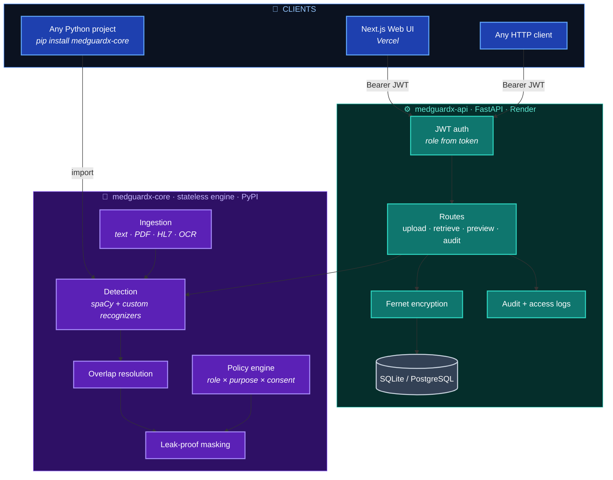
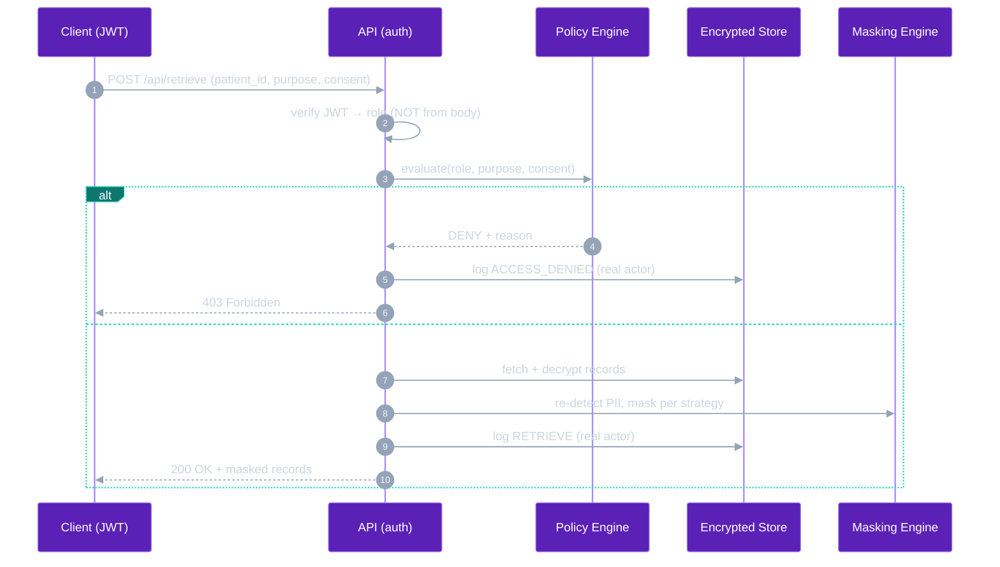
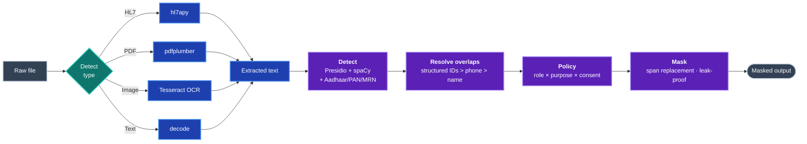

<div align="center">

# 🛡️ MedGuardX

### Context-aware PII/PHI detection & masking for healthcare data — a reusable engine you embed, plus a hardened, deployed reference app.

[](https://pypi.org/project/medguardx-core/)
[](https://pypi.org/project/medguardx-core/)
[](https://github.com/adarshcod30/MedGuardX/actions/workflows/ci.yml)
[](LICENSE)
[](.)

[**Live Demo**](https://med-guard-x.vercel.app) &nbsp;·&nbsp; [**PyPI Package**](https://pypi.org/project/medguardx-core/) &nbsp;·&nbsp; [**Report Bug**](https://github.com/adarshcod30/MedGuardX/issues) &nbsp;·&nbsp; [**Request Feature**](https://github.com/adarshcod30/MedGuardX/issues)

`pii` · `phi` · `healthcare` · `data-masking` · `anonymization` · `presidio` · `spacy` · `fastapi` · `nextjs` · `hipaa` · `gdpr` · `dpdp`

</div>

---

## Table of Contents

- [Overview](#overview)
- [Key Features](#key-features)
- [Tech Stack](#tech-stack)
- [System Architecture](#system-architecture)
- [Application Flow](#application-flow)
- [The Detection & Masking Pipeline](#the-detection--masking-pipeline)
- [Accuracy & Model Performance](#accuracy--model-performance)
- [Security Model](#security-model)
- [Deployment & Infrastructure](#deployment--infrastructure)
- [Project Structure](#project-structure)
- [Getting Started](#getting-started)
- [Usage / API Reference](#usage--api-reference)
- [Testing](#testing)
- [Roadmap](#roadmap)
- [Contributing](#contributing)
- [License](#license)
- [Contact](#contact)

---

## Overview

**Problem.** Healthcare organizations sit on mountains of unstructured data — clinical notes, discharge summaries, PDFs, HL7 messages — with PII/PHI (names, phones, Aadhaar/PAN, addresses) deeply embedded. Sharing it for treatment, research, billing, or legal purposes is risky: manual redaction is slow and error-prone, and naïve regex tools miss context. Over-redact and the data is useless; under-redact and you leak protected health information.

**Solution.** MedGuardX applies **context-aware, mask-on-read** protection. Raw text is encrypted at rest; when it's retrieved, a policy engine evaluates *who* is asking, *why*, and *whether the patient consented*, and produces a dynamically masked view tailored to that authorization level. The detection/masking logic is packaged as a **stateless, pip-installable engine** ([`medguardx-core`](https://pypi.org/project/medguardx-core/)) that any project can embed, wrapped by a **hardened FastAPI service** and a **Next.js** reference UI.

**Why it matters.** The reusable core is stateless and auth-agnostic *by design* — a library that never authenticates has no auth to bypass, and an engine that never stores has no database to leak. Everything stateful (identity, persistence, audit) lives in the service layer, where it's enforced and tested. That separation is what makes the engine safe to drop into any codebase.

**Keywords:** `pii` `phi` `healthcare` `data-masking` `anonymization` `presidio` `spacy` `nlp` `fastapi` `nextjs` `hipaa` `gdpr` `dpdp` `privacy-by-design`

## Key Features

| Feature | Description |
|---|---|
| **Context-aware masking** | A `(role × purpose × consent)` policy matrix decides the strategy per request — full access, partial mask, full anonymize, or deny — deny-by-default for anything unmapped. |
| **Bring-your-own model** | Any spaCy English pipeline works — `en_core_web_sm` / `md` / `lg` / `trf`. Pick your accuracy/RAM trade-off via one config value; nothing else changes. |
| **Model-independent structured IDs** | Aadhaar (Verhoeff-checksum validated), PAN, MRN, credit cards, IBAN, IP are matched by format, so they work identically on every model. |
| **Leak-proof masking** | Overlapping detections are resolved by a deterministic priority table; no strategy ever leaves part of a detected identifier visible. |
| **Enforced RBAC** | JWT verified on every protected route; the caller's role comes from the **token**, never the request body. Admin cannot be self-registered. |
| **Encrypted at rest** | Fernet (AES-128-CBC + HMAC); the service refuses to start in production without a real key. |
| **Pluggable storage** | One SQLAlchemy code path over SQLite (dev) and Postgres (prod). |
| **Multi-format ingestion** | Text, PDF (`pdfplumber`), HL7 (`hl7apy`), and image OCR (`pytesseract`, where a Tesseract binary is available). |
| **Attributable audit trail** | Every access is logged with the real authenticated actor and the applied policy. |

## Tech Stack

| Layer | Technology |
|---|---|
| OSS Engine | Python 3.9+ · Microsoft **Presidio** (analyzer + anonymizer) · **spaCy** (configurable NER model) |
| Backend / API | **FastAPI** · Uvicorn · **SQLAlchemy** · python-jose (JWT) · passlib/bcrypt · cryptography (Fernet) |
| Frontend | **Next.js 14** (App Router) · React 18 · TypeScript · Tailwind CSS · Framer Motion |
| Database | SQLite (dev) · **PostgreSQL** (prod) |
| Ingestion | pdfplumber (PDF) · hl7apy (HL7) · pytesseract + Pillow (image OCR) |
| Infra / Deployment | **Render** (API + managed Postgres, native Python) · **Vercel** (web) — container-free |
| CI/CD | **GitHub Actions** — tests + web build; **PyPI Trusted Publishing** (OIDC) for the package |
| Packaging | hatchling · published to **PyPI** as `medguardx-core` |

## System Architecture

MedGuardX is a monorepo with three layers. The **core engine** is a pure function of text and context — no I/O, no state. The **API service** wraps it with authentication, encryption, storage, and audit. The **web app** is a thin client. Python integrators import the engine directly; everyone else calls the API over HTTP.


```mermaid
flowchart TD
    subgraph Clients["👤 &nbsp;CLIENTS"]
      WEB["Next.js Web UI<br/><i>Vercel</i>"]
      SDK["Any Python project<br/><i>pip install medguardx-core</i>"]
      HTTP["Any HTTP client"]
    end

    subgraph Service["⚙️ &nbsp;medguardx-api · FastAPI · Render"]
      AUTH["JWT auth<br/><i>role from token</i>"]
      ROUTES["Routes<br/>upload · retrieve · preview · audit"]
      ENC["Fernet encryption"]
      STORE[("SQLite / PostgreSQL")]
      AUDIT["Audit + access logs"]
    end

    subgraph Core["🧠 &nbsp;medguardx-core · stateless engine · PyPI"]
      ING["Ingestion<br/><i>text · PDF · HL7 · OCR</i>"]
      DET["Detection<br/><i>spaCy + custom recognizers</i>"]
      OVL["Overlap resolution"]
      POL["Policy engine<br/><i>role × purpose × consent</i>"]
      MASK["Leak-proof masking"]
    end

    WEB -->|Bearer JWT| AUTH
    HTTP -->|Bearer JWT| AUTH
    AUTH --> ROUTES
    ROUTES --> ENC --> STORE
    ROUTES --> AUDIT
    ROUTES --> DET
    SDK -->|import| DET
    ING --> DET --> OVL --> MASK
    POL --> MASK

    classDef client fill:#1e40af,stroke:#60a5fa,color:#fff,stroke-width:2px
    classDef svc fill:#0f766e,stroke:#2dd4bf,color:#fff,stroke-width:2px
    classDef core fill:#5b21b6,stroke:#a78bfa,color:#fff,stroke-width:2px
    classDef data fill:#334155,stroke:#cbd5e1,color:#fff,stroke-width:2px
    class WEB,SDK,HTTP client
    class AUTH,ROUTES,ENC,AUDIT svc
    class STORE data
    class ING,DET,OVL,POL,MASK core
    style Clients fill:#0b1220,stroke:#3b82f6,color:#93c5fd
    style Service fill:#052e2b,stroke:#14b8a6,color:#5eead4
    style Core fill:#2e1065,stroke:#8b5cf6,color:#c4b5fd
```

## Application Flow

The retrieval path is where context-aware masking happens. Role is derived from the **verified token**; only `purpose` and `consent` are caller-supplied. PII is re-detected on the decrypted text each time, so masking never depends on possibly-stale metadata.


```mermaid
%%{init: {'theme':'base','themeVariables':{'primaryColor':'#1e40af','primaryTextColor':'#fff','primaryBorderColor':'#60a5fa','actorBkg':'#5b21b6','actorBorder':'#a78bfa','actorTextColor':'#fff','signalColor':'#94a3b8','signalTextColor':'#cbd5e1','labelBoxBkgColor':'#0f766e','labelBoxBorderColor':'#2dd4bf','labelTextColor':'#fff','noteBkgColor':'#334155','noteTextColor':'#fff','noteBorderColor':'#cbd5e1'}}}%%
sequenceDiagram
    autonumber
    participant U as Client (JWT)
    participant A as API (auth)
    participant P as Policy Engine
    participant DB as Encrypted Store
    participant M as Masking Engine

    U->>A: POST /api/retrieve (patient_id, purpose, consent)
    A->>A: verify JWT → role (NOT from body)
    A->>P: evaluate(role, purpose, consent)
    alt Denied
        P-->>A: DENY + reason
        A->>DB: log ACCESS_DENIED (real actor)
        A-->>U: 403 Forbidden
    else Allowed
        A->>DB: fetch + decrypt records
        A->>M: re-detect PII, mask per strategy
        A->>DB: log RETRIEVE (real actor)
        A-->>U: 200 OK + masked records
    end
```

## The Detection & Masking Pipeline

Given raw text and a request context, the engine runs five deterministic stages:


```mermaid
flowchart LR
    A[Raw file] --> B{Detect<br/>type}
    B -->|HL7| C[hl7apy]
    B -->|PDF| D[pdfplumber]
    B -->|Image| E[Tesseract OCR]
    B -->|Text| F[decode]
    C & D & E & F --> G[Extracted text]
    G --> H["<b>Detect</b><br/>Presidio + spaCy<br/>+ Aadhaar/PAN/MRN"]
    H --> I["<b>Resolve overlaps</b><br/>structured IDs &gt; phone &gt; name"]
    I --> J["<b>Policy</b><br/>role × purpose × consent"]
    J --> K["<b>Mask</b><br/>span replacement · leak-proof"]
    K --> L([Masked output])

    classDef ingest fill:#1e40af,stroke:#60a5fa,color:#fff,stroke-width:2px
    classDef stage fill:#5b21b6,stroke:#a78bfa,color:#fff,stroke-width:2px
    classDef gate fill:#0f766e,stroke:#2dd4bf,color:#fff,stroke-width:2px
    classDef io fill:#334155,stroke:#cbd5e1,color:#fff,stroke-width:2px
    class A,L io
    class B gate
    class C,D,E,F,G ingest
    class H,I,J,K stage
```

**1. Ingest.** File type is detected and routed to the right extractor. Extraction failures (corrupt file, OCR engine absent) raise `ExtractionError` and are rejected — never stored as content.

**2. Detect.** Presidio runs the configured spaCy pipeline for linguistic entities (`PERSON`, `LOCATION`, `PHONE_NUMBER`, `EMAIL_ADDRESS`, …) plus **custom, model-independent `PatternRecognizer`s** for Aadhaar (Verhoeff-validated), PAN, and MRN. `DATE_TIME` is intentionally excluded from the default set because it used to shadow phone/Aadhaar spans.

**3. Resolve overlaps.** When detections overlap, a fixed priority table picks the winner — structured IDs (`IN_AADHAAR`, `CREDIT_CARD`) outrank `PHONE_NUMBER`, which outranks `PERSON`/`LOCATION`. This makes masking **deterministic**: the same input always yields the same output, eliminating the old "sometimes masked, sometimes not" flakiness.

**4. Evaluate policy.** `(role, purpose, consent)` maps to one of four strategies with a human-readable rationale; unmapped combinations deny by default.

**5. Mask.** Detected spans are replaced right-to-left (so indices stay valid). The invariant: for any strategy other than `full_access`, the original identifier substring **never** survives in the output. Partial masking reveals only a bounded, safe hint (e.g. `[CARD ****1111]`).

| Strategy | Behaviour |
|---|---|
| `full_access` | text returned unchanged |
| `partial_mask` | identifiers redacted; card/phone/email keep a minimal safe hint |
| `full_anonymize` | every identifier replaced with a typed `[TYPE_REDACTED]` token |
| `deny` | access refused; no data returned |

## Accuracy & Model Performance

The structured-ID recognizers are exact by construction. The statistical NER (names, locations) depends on the spaCy model and the text domain. Measured behaviour, `en_core_web_md`:

**Before vs after** (identical inputs — these are the concrete bugs the engine fixes):

| Input | Naïve build | MedGuardX |
|---|---|---|
| `9305597756` (phone, in a note) | `[REDACTED]` (mis-typed) | `[PHONE_REDACTED]` |
| `2341 2341 2346` / `234123412346` (Aadhaar) | often missed / plaintext | `[AADHAAR_REDACTED]` |
| `192.168.1.55` (partial mask) | `********1.55` (**leak**) | `[IP_REDACTED]` |
| `4111 1111 1111 1111` (card) | `********1 1111 1111` (**leak**) | `[CARD ****1111]` |

**Domain matters.** On **clinical/PII text** (the intended domain) precision is high. On an **out-of-domain document** — e.g. a tech résumé — the model *over-redacts*: capitalized product names (LangGraph, Docker, Pydantic) get tagged as `PERSON`/`LOCATION`. In one résumé test, 24 entities were detected of which ~14 were false positives (tech terms), and a single-token first name was missed. This is a known limitation of statistical NER on out-of-domain input, not a masking defect — it errs toward *over*-masking (safe), and clinical notes carry far less of this noise. Larger models (`lg`/`trf`) reduce some false positives.

| Model | RAM (loaded) | NER quality | Notes |
|---|---|---|---|
| `en_core_web_sm` | ~50 MB | baseline | smallest; fits tight environments |
| `en_core_web_md` | ~120 MB | good | **default** (used by the hosted demo) |
| `en_core_web_lg` | ~600 MB | better | best statistical model |
| `en_core_web_trf` | ~1.5 GB + PyTorch | highest | transformer; needs a larger host |

## Security Model

The reference API is hardened around a simple principle: **trust the token, never the request body.**

- **Authentication enforced** on every protected route via `Depends(get_current_user)`; a missing/invalid token is rejected (401).
- **Role derived from the JWT**, so a caller cannot escalate privilege by putting `"role": "doctor"` in the body.
- **No admin self-registration** — `/api/register` refuses privileged roles; admins are seeded out-of-band via `MEDGUARDX_ADMIN_USERNAME` / `MEDGUARDX_ADMIN_PASSWORD`.
- **Encryption at rest** with a key that is **required in production** (the service fails fast if it's missing, rather than silently using a throwaway key).
- **Deny-by-default policy** for any unmapped `(role, purpose, consent)`.
- **Explicit CORS allowlist** — wildcards are rejected in production.
- **Attributable audit trail** — every access records the real authenticated actor.

## Deployment & Infrastructure

Container-free, two independent deployments (full guide in [DEPLOYMENT.md](DEPLOYMENT.md)):

- **API + database → Render.** [`render.yaml`](render.yaml) provisions managed Postgres and a native-Python service (`pip install` + `spacy download` + `uvicorn`). `MEDGUARDX_JWT_SECRET` is auto-generated and the DB URL auto-injected; you set `MEDGUARDX_FERNET_KEY` once (and never rotate it). Health check at `/health`.
- **Web → Vercel.** Import the repo, set **Root Directory = `apps/web`**, and point `NEXT_PUBLIC_API_URL` at the Render API. [`apps/web/vercel.json`](apps/web/vercel.json) pins the Next.js build.
- **CI/CD → GitHub Actions.** [`ci.yml`](.github/workflows/ci.yml) runs the core + API test suites (Python 3.11/3.12) and the web build on every push/PR. [`publish-pypi.yml`](.github/workflows/publish-pypi.yml) publishes `medguardx-core` to PyPI via **Trusted Publishing (OIDC)** on each GitHub Release — no tokens stored.
- **Environments.** `MEDGUARDX_ENVIRONMENT=production` turns on strict checks (secrets required, no wildcard CORS). Local dev defaults to SQLite and ephemeral keys.

> **Note:** Render's native runtime has no Tesseract binary, so **image OCR is disabled on the hosted demo** — text, PDF, and HL7 are fully supported. Image OCR works on any self-hosted deployment with `tesseract-ocr` installed.

## Project Structure

```text
MedGuardX/
├── packages/
│   └── medguardx-core/          # stateless PII/PHI engine — published to PyPI (Apache-2.0)
│       ├── src/medguardx/
│       │   ├── engine.py         # MedGuardEngine facade (detect → policy → mask)
│       │   ├── detection.py      # Presidio wrapper + overlap resolution
│       │   ├── recognizers/      # Aadhaar (Verhoeff), PAN, MRN — model-independent
│       │   ├── policy.py         # role × purpose × consent matrix
│       │   ├── masking.py        # leak-proof span replacement
│       │   ├── ingestion.py      # text · PDF · HL7 · OCR
│       │   └── config.py         # model choice, thresholds, entities
│       └── tests/                # 22 unit tests (model-free)
├── apps/
│   ├── api/                     # FastAPI service (auth · storage · audit · encryption)
│   │   ├── medguardx_api/
│   │   └── tests/               # 11 API tests
│   └── web/                     # Next.js 14 reference UI
├── .github/workflows/           # ci.yml · publish-pypi.yml
├── render.yaml · DEPLOYMENT.md  # deployment blueprint + guide
└── README.md
```

## Getting Started

### A. Use the engine in your own project (from PyPI)

```bash
pip install medguardx-core
python -m spacy download en_core_web_md    # or sm / lg / trf
```

```python
from medguardx import MedGuardEngine, EngineConfig, Role, Purpose

engine = MedGuardEngine(EngineConfig(model="en_core_web_md"))
result = engine.process(
    "Patient John Smith, Aadhaar 2341 2341 2346, card 4111 1111 1111 1111.",
    role=Role.NURSE, purpose=Purpose.TREATMENT, consent=False,
)
print(result.masked_text)
# Patient [NAME_REDACTED], Aadhaar [AADHAAR_REDACTED], card [CARD ****1111].
```

### B. Run the full stack locally

**Prerequisites:** Python 3.9+, Node.js 18+. (Optional: `tesseract-ocr` for image OCR.)

```bash
git clone https://github.com/adarshcod30/MedGuardX.git
cd MedGuardX

# --- API (terminal 1) ---
pip install "./packages/medguardx-core" "./apps/api[dev]"
python -m spacy download en_core_web_md
cp apps/api/.env.example apps/api/.env        # fill in the two secrets it describes
cd apps/api && uvicorn medguardx_api.main:app --reload --port 8000
#   API docs → http://localhost:8000/docs

# --- Web (terminal 2) ---
cd apps/web && npm install
NEXT_PUBLIC_API_URL=http://localhost:8000 npm run dev
#   Web → http://localhost:3000
```

Storage defaults to a local SQLite file — no database service needed for dev.

### Environment Variables (API)

```bash
cp apps/api/.env.example apps/api/.env
# Generate the secrets:
#   JWT   : python -c "import secrets; print(secrets.token_urlsafe(48))"
#   Fernet: python -c "from cryptography.fernet import Fernet; print(Fernet.generate_key().decode())"
```

## Usage / API Reference

All `/api/*` data endpoints require a `Bearer` token. **Role is derived from the token**, so retrieve/preview bodies carry only `purpose` and `consent`.

| Method | Endpoint | Auth | Description |
|---|---|---|---|
| `POST` | `/api/register` | — | Create an account (privileged roles refused); returns a JWT |
| `POST` | `/api/login` | — | Authenticate; returns a JWT |
| `POST` | `/api/upload` | any user | Ingest a file → detect + encrypt + store |
| `POST` | `/api/retrieve` | any user | Context-aware masked retrieval |
| `POST` | `/api/preview` | any user | Live masking sandbox |
| `GET`  | `/api/audit` | admin / doctor | Paginated audit log |
| `GET`  | `/api/stats` | any user | Dashboard counters |
| `GET`  | `/health` | — | Health check |

```bash
# Register, then preview masking as that role:
TOKEN=$(curl -s -X POST https://medguardx-backend.onrender.com/api/register \
  -H "Content-Type: application/json" \
  -d '{"username":"dr_demo","password":"password123","role":"doctor"}' | jq -r .access_token)

curl -X POST https://medguardx-backend.onrender.com/api/preview \
  -H "Authorization: Bearer $TOKEN" -H "Content-Type: application/json" \
  -d '{"text":"Patient John Smith, Aadhaar 2341 2341 2346.","purpose":"research","consent":false}'
```

## Testing

```bash
# Core engine — 22 unit tests, no model needed
cd packages/medguardx-core && pip install -e ".[dev]" && pytest -q

# API service — 11 tests (stub engine, no model)
cd apps/api && pip install -e ".[dev]" && pytest -q
```

**33 tests total**, covering: overlap resolution, leak-proof masking, Aadhaar Verhoeff validation, policy deny-by-default, extraction-failure rejection, and the security invariants (auth enforced, role-from-token, no admin self-registration, role-gated audit). CI runs everything on Python 3.11 and 3.12 plus the web build.

## Roadmap

- [ ] Patient-driven consent records (replace the caller-supplied consent flag)
- [ ] Refresh-token rotation and token revocation
- [ ] Optional tech-term deny-list for cleaner non-clinical (résumé/general) masking
- [ ] Configurable per-entity masking operators via the API
- [ ] Additional locale recognizers (structured IDs for more countries)

See [open issues](https://github.com/adarshcod30/MedGuardX/issues) for the full list.

## Contributing

Contributions are welcome.
1. Fork the project
2. Create a feature branch (`git checkout -b feature/your-feature`)
3. Commit your changes and ensure `pytest` passes in both packages
4. Push and open a Pull Request

## License

Distributed under the **Apache-2.0** License. See [LICENSE](LICENSE) for details.

## Contact

**Adarsh Dwivedi** — [GitHub](https://github.com/adarshcod30) · [LinkedIn](https://linkedin.com/in/adarshcod30)

Project: [github.com/adarshcod30/MedGuardX](https://github.com/adarshcod30/MedGuardX) · Package: [pypi.org/project/medguardx-core](https://pypi.org/project/medguardx-core/) · Demo: [med-guard-x.vercel.app](https://med-guard-x.vercel.app)
